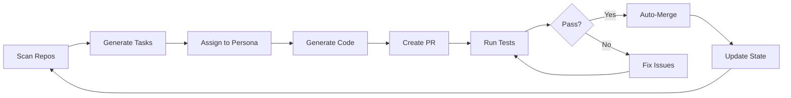

# Genesis - Autonomous Software Factory

<div align="center">


[](LICENSE)
[](https://www.python.org)
[](https://www.typescriptlang.org)

**Zero Human Hands - Autonomous Recursive Self-Improvement**

</div>

## 🌟 Overview

Genesis is a FAANG-grade, enterprise-level **autonomous software factory** that achieves recursive self-improvement without human intervention. Once initialized, Genesis continuously:

- 🔍 **Scans** repositories for improvement opportunities
- 🧠 **Plans** tasks based on intelligent analysis
- 💻 **Codes** solutions using specialized AI personas
- ✅ **Validates** changes through automated testing
- 🚀 **Deploys** approved changes automatically
- 🔄 **Repeats** indefinitely, evolving itself

## 🏗️ Architecture

Genesis consists of five core components:

### 1. Autonomous Loop (GitHub Actions)
Scheduled workflow that runs every 6 hours, executing the Plan → Code → Validate → Deploy cycle.

### 2. Agent Core (Python)
The brain of the system with specialized AI personas:
- **Chief Architect**: System design and architecture
- **Frontend Lead**: React/Next.js development
- **Backend Lead**: API and business logic
- **DevSecOps Engineer**: CI/CD and infrastructure
- **QA Engineer**: Testing and quality assurance

### 3. Mission Control UI (Next.js)
Futuristic web interface for monitoring agent activities and system health.

### 4. Persistent State
JSON manifest tracking system epoch, active agents, and task queue.

### 5. Infrastructure (Docker)
Containerized services including vector DB (Qdrant), LLM inference (Ollama), and caching (Redis).

## 🚀 Quick Start

### Prerequisites

- Python 3.11+
- Node.js 18+
- Docker & Docker Compose
- GitHub token (for API access)

### Installation

1. **Clone the repository**
```bash
git clone https://github.com/InfinityXOneSystems/genesis.git
cd genesis
```

2. **Install Python dependencies**
```bash
pip install -r requirements.txt
```

3. **Install frontend dependencies**
```bash
cd src/frontend
npm install
```

4. **Configure environment**
```bash
export GITHUB_TOKEN=your_github_token_here
```

5. **Start with Docker Compose**
```bash
docker-compose up -d
```

### Access Points

- **Mission Control UI**: http://localhost:3000
- **Code Editor**: http://localhost:3000/editor
- **API Backend**: http://localhost:8000
- **Qdrant UI**: http://localhost:6333/dashboard

## 📖 Documentation

- [System Architecture](docs/SYSTEM_ARCHITECTURE.md) - Detailed architectural overview
- [System Instructions](prompts/system_instructions.md) - Agent personas and prompts

## 🔧 Manual Execution

Run individual phases of the autonomous loop:

```bash
# Plan phase - scan and generate tasks
python src/genesis/core/loop.py plan

# Code phase - execute autonomous coding
python src/genesis/core/loop.py code

# Validate phase - run tests and checks
python src/genesis/core/loop.py validate

# Deploy phase - merge approved changes
python src/genesis/core/loop.py deploy

# Full cycle
python src/genesis/core/loop.py full
```

## 🤖 How It Works

### The Recursive Loop



### Auto-Merge Logic

PRs labeled `autonomous-verified` are automatically merged if:
- All CI checks pass ✅
- No merge conflicts 🔀
- Code quality standards met 📊
- Security scans clean 🔒

## 🎯 Features

### Autonomous Capabilities
- ✨ Self-improving codebase
- 🔄 Continuous integration and deployment
- 🧪 Automated testing at all levels
- 🔐 Security scanning and compliance
- 📊 Real-time monitoring and metrics

### Quality Assurance
- Type-safe (Python type hints, TypeScript)
- 80%+ code coverage target
- Comprehensive linting and formatting
- Security vulnerability scanning
- Performance monitoring

## 📊 System Manifest

The `genesis_manifest.json` tracks:

```json
{
  "version": "0.1.0",
  "epoch": 1,
  "status": "active",
  "active_agents": [...],
  "task_queue": [...],
  "metrics": {
    "tasks_completed": 0,
    "total_commits": 0,
    "total_prs": 0
  }
}
```

## 🛠️ Development

### Running Tests

```bash
# Python tests
pytest tests/ -v --cov=src

# Frontend tests
cd src/frontend
npm test
```

### Code Quality

```bash
# Python linting
black src/
pylint src/genesis

# Frontend linting
cd src/frontend
npm run lint
```

## 🔒 Security

- GitHub token stored securely in secrets
- No hardcoded credentials
- Dependency vulnerability scanning
- CodeQL security analysis
- Regular security audits

## 🌐 Contributing

While Genesis is designed for autonomy, human contributions are welcome for:
- Core system improvements
- New agent persona definitions
- Enhanced scanning heuristics
- UI/UX improvements

See [CONTRIBUTING.md](CONTRIBUTING.md) for guidelines.

## 📜 License

MIT License - see [LICENSE](LICENSE) for details

## 🙏 Acknowledgments

Built with:
- [FastAPI](https://fastapi.tiangolo.com/) - Modern Python web framework
- [Next.js](https://nextjs.org/) - React framework
- [Qdrant](https://qdrant.tech/) - Vector database
- [Ollama](https://ollama.ai/) - Local LLM inference
- [GitHub Actions](https://github.com/features/actions) - CI/CD automation

---

<div align="center">

**Genesis Prime: The Future is Autonomous**

*Built by agents, for agents. Zero Human Hands.*

</div>
