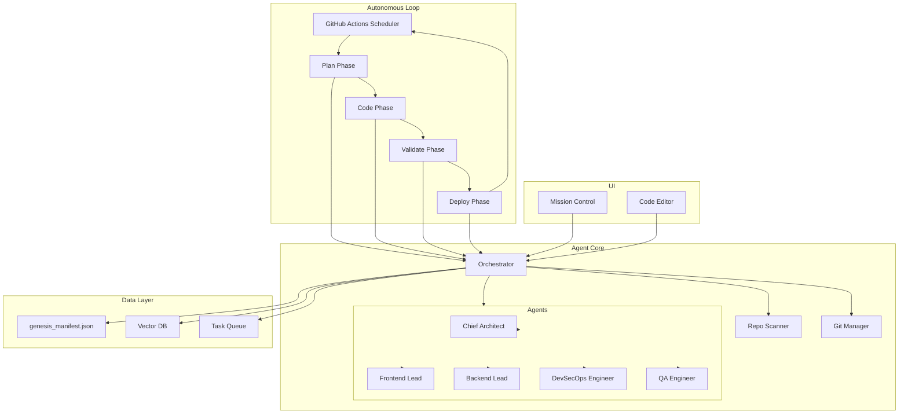

# Genesis System Architecture

## Overview

Genesis is a FAANG-grade, enterprise-level autonomous software factory designed to achieve recursive self-improvement with **Zero Human Hands** intervention.

## Core Philosophy: Zero Human Hands

The Genesis system operates on a fundamental principle: **complete autonomy**. Once initialized, the system:

1. **Scans** repositories for improvement opportunities
2. **Plans** tasks based on analysis and priorities
3. **Codes** solutions using specialized AI personas
4. **Validates** changes through automated testing
5. **Deploys** approved changes automatically
6. **Repeats** the cycle indefinitely

This creates a recursive loop of continuous improvement where the system evolves itself.

## System Components

### 1. The Autonomous Loop (GitHub Actions)

**Location:** `.github/workflows/genesis-loop.yml`

The heart of the autonomous system. Runs on a schedule (every 6 hours) and executes:

- **Plan Phase**: Scans repositories, identifies improvements
- **Code Phase**: Executes autonomous coding tasks
- **Validate Phase**: Runs tests and quality checks
- **Deploy Phase**: Merges approved changes

### 2. Agent Core (Python)

**Location:** `src/genesis/core/`

The brain of the system, consisting of:

#### Orchestrator (`orchestrator.py`)
- Coordinates all agent activities
- Manages task queue and distribution
- Tracks system state and metrics
- Executes autonomous cycles

#### Agent Team (`agent_team.py`)
Defines specialized personas:

- **Chief Architect**: System design, architectural decisions
- **Frontend Lead**: UI/UX, React/Next.js development
- **Backend Lead**: APIs, business logic, databases
- **DevSecOps Engineer**: CI/CD, infrastructure, security
- **QA Engineer**: Testing, quality assurance

Each persona has:
- Specific expertise and responsibilities
- Tailored system prompts for optimal performance
- Dedicated tools and capabilities

#### Repository Scanner (`repo_scanner.py`)
- Connects to GitHub API
- Analyzes repository health
- Identifies improvement opportunities
- Generates actionable tasks

#### Git Manager (`git_manager.py`)
- Creates feature branches
- Commits changes programmatically
- Opens pull requests
- Manages PR labels and automation

### 3. Mission Control UI (Next.js)

**Location:** `src/frontend/`

A futuristic web interface providing:

- **Dashboard**: Real-time agent status, system metrics
- **Code Editor**: Monaco-based editor with AI integration
- **Task Monitor**: Track autonomous activities
- **System Health**: Monitor performance and issues

### 4. Persistent State

**Location:** `genesis_manifest.json`

Tracks:
- Current system epoch
- Active agents and their status
- Task queue
- Metrics (tasks completed, PRs created, etc.)
- System configuration

### 5. Infrastructure (Docker)

**Location:** `docker-compose.yml`

Services:
- **genesis-core**: Python backend (FastAPI)
- **genesis-web**: Next.js frontend
- **qdrant**: Vector database for agent memory
- **ollama**: Local LLM inference
- **redis**: Task queue and caching

## Architecture Diagram

## Data Flow

1. **Initialization**: System loads manifest, initializes agents
2. **Scan**: Repository scanner analyzes codebases via GitHub API
3. **Task Generation**: Opportunities converted to tasks
4. **Assignment**: Orchestrator assigns tasks to appropriate personas
5. **Execution**: Agents generate code/changes using LLMs
6. **Commit**: Git manager creates branches, commits, opens PRs
7. **Validation**: Automated tests and quality checks run
8. **Merge**: Auto-merge workflow merges approved PRs
9. **Update**: System state updated, epoch incremented
10. **Repeat**: Cycle continues indefinitely

## Key Features

### Autonomous Task Management
- Automatic task generation from repository analysis
- Intelligent task prioritization
- Persona-based task assignment

### Quality Assurance
- Automated testing at multiple levels
- Code quality checks (linting, type checking)
- Security scanning (CodeQL, dependency checks)

### Auto-Merge Logic
- PRs labeled `autonomous-verified` auto-merge
- Only merges if all CI checks pass
- Squash merge for clean history

### Self-Improvement
- System can modify its own code
- Agents can propose architectural improvements
- Continuous evolution through feedback loops

## Security Considerations

- GitHub token management via secrets
- Code review before merge (even for autonomous PRs)
- Security scanning on all changes
- Audit trail via Git history

## Scalability

The system is designed to scale:
- **Horizontally**: Multiple instances can run concurrently
- **Vertically**: Can handle increasing repository complexity
- **Temporally**: Continuous operation over extended periods

## Future Enhancements

### Phase 2: Advanced Intelligence
- Enhanced LLM integration (GPT-4, Claude)
- Multi-modal reasoning
- Context-aware code generation

### Phase 3: Ecosystem Expansion
- Multi-repository coordination
- Cross-project refactoring
- Dependency management across repos

### Phase 4: Emergent Behaviors
- Self-modifying architectures
- Novel algorithm discovery
- Autonomous bug discovery and patching

## Getting Started

See `README.md` for setup and deployment instructions.

## Contributing

While Genesis is designed to be autonomous, human contributions are welcome for:
- Core system improvements
- New agent persona definitions
- Enhanced scanning heuristics
- UI/UX improvements

---

**Remember**: The goal is **Zero Human Hands**. The system should operate independently, improving itself recursively without manual intervention.
